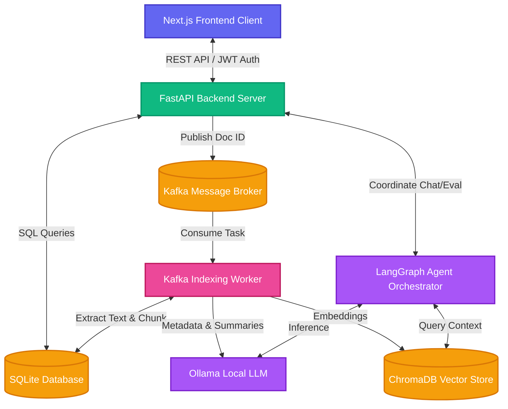
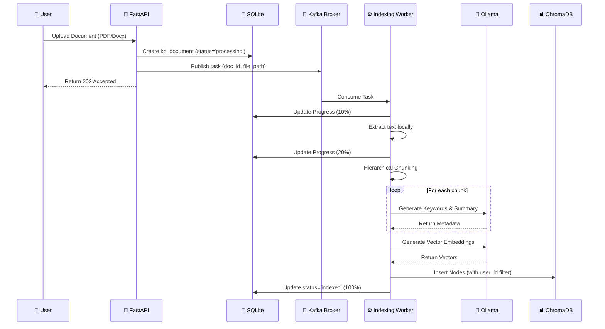
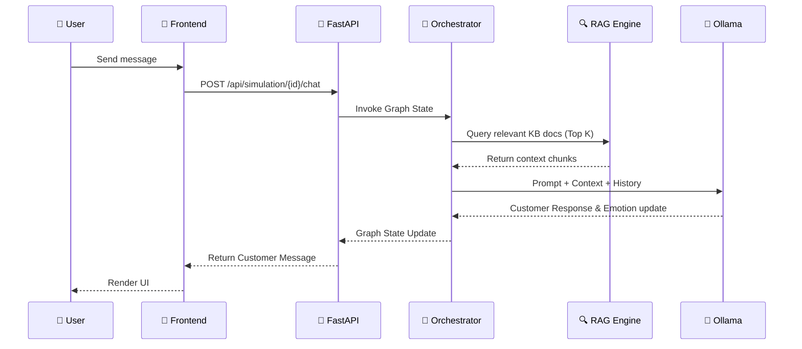
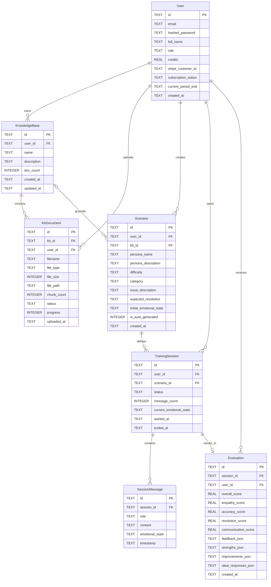

# SupportSim AI: Architecture & API Documentation

This document provides a comprehensive overview of the technical architecture, data flows, database schema, and API documentation for the **SupportSim AI — Customer Support Agent Training Platform**.

---

## 1. System Overview

SupportSim AI is designed as a local-first, privacy-focused SaaS application. All AI inference is performed locally using Ollama, ensuring zero API costs and complete data privacy.

### High-Level Architecture

---

## 2. Component Architecture

### Frontend Layer (Next.js)

The frontend is built using Next.js 15 (App Router) with Tailwind CSS for styling and Framer Motion for animations. It communicates with the backend exclusively via REST APIs.

- **Routing:** Uses `/(auth)` for unauthenticated routes and `/(main)` for authenticated dashboard routes.
- **State Management:** React `useState`/`useEffect` hooks, heavily relying on server-side rendering where applicable, but interactive components (chats, knowledge selectors) are marked `"use client"`.

### Backend Layer (FastAPI)

The core backend is a modular FastAPI application running on Python 3.11+.

- **`routers/`**: Exposes REST endpoints grouped by feature (auth, knowledge base, simulation, evaluation, billing).
- **`services/`**: Contains business logic (`db.py`, `rag_engine.py`, `doc_processor.py`, `auth_utils.py`).

### Agent Orchestration (LangGraph)

The AI interaction logic is driven by LangGraph, forming a multi-agent system:

- **Orchestrator (`orchestrator.py`)**: Manages the state graph between user input and AI responses.
- **Customer Agent (`customer_agent.py`)**: Acts as the simulated customer, evolving emotional state based on user responses.
- **Evaluator Agent (`evaluator_agent.py`)**: Grades the user's responses after the session ends.
- **Feedback Agent (`feedback_agent.py`)**: Provides coaching tips and alternative responses.
- **Suggestion Agent (`suggestion_agent.py`)**: Provides real-time Copilot autocomplete suggestions during the chat.

### RAG Pipeline (LlamaIndex + ChromaDB)

The RAG (Retrieval-Augmented Generation) system powers the simulation by giving the AI context from uploaded files.

- **Models**: Uses `llama3.2:3b` for inference/metadata and `nomic-embed-text` for embeddings.
- **Isolation**: Tenant data is strictly isolated. All nodes embedded into ChromaDB contain metadata `user_id` and `kb_id`, and queries strictly filter via `ExactMatchFilter` to prevent data leakage between users.

---

## 3. Data Flow Diagrams

### Document Indexing Workflow (Kafka)

### Training Session Workflow

---

## 4. Database Schema (ERD)

The application relies on SQLite with a localized schema designed for multi-tenancy.

### Table Definitions

| Table               | Description                                                                    |
| :------------------ | :----------------------------------------------------------------------------- |
| **User**            | Core user profile, authentication, and credit/billing tracking.                |
| **KnowledgeBase**   | Logic containers for grouping related training documents.                      |
| **KbDocument**      | Metadata for uploaded files (PDF/DOCX/URL). Tracks indexing progress (0-100%). |
| **Scenario**        | AI-generated or manually created training personas and customer issues.        |
| **TrainingSession** | An active or completed interaction between a trainee and an AI customer.       |
| **SessionMessage**  | The full transcript of a session, including roles and emotional states.        |
| **Evaluation**      | AI-generated scores and coaching feedback for a completed session.             |

## 5. API Documentation

All routes under `/api` require a valid JWT token in the `Authorization: Bearer <token>` header, except for Auth routes and Stripe webhooks.

### Authentication (`/api/auth`)

- **`POST /register`**: Create a new user account.
- **`POST /login`**: Authenticate and return an access token (OAuth2 form-data).
- **`GET /me`**: Get the current authenticated user's profile and credit balance.

### Knowledge Base (`/api/kb`)

- **`GET /`**: List all knowledge bases for the current user.
- **`POST /`**: Create a new knowledge base.
- **`GET /{kb_id}`**: Get specific knowledge base details, including nested documents.
- **`DELETE /{kb_id}`**: Delete a knowledge base and all associated documents/vectors.
- **`POST /{kb_id}/upload`**: Upload a document (PDF, DOCX, TXT) and queue it to Kafka for indexing.
- **`DELETE /{kb_id}/documents/{doc_id}`**: Delete a specific document and its vector embeddings.
- **`POST /{kb_id}/scrape`**: Scrape a URL and add its content as a document to the KB.
- **`POST /{kb_id}/documents/{doc_id}/chat`**: Chat strictly with a specific document (Document isolation).

### Scenarios (`/api/scenarios`)

- **`GET /`**: List all training scenarios.
- **`POST /`**: Manually create a new training scenario.
- **`GET /{scenario_id}`**: Get specific scenario details.
- **`DELETE /{scenario_id}`**: Delete a scenario.
- **`POST /generate/{kb_id}`**: Auto-generate a realistic training scenario strictly based on the contents of a specific Knowledge Base.

### Training Simulation (`/api/simulation`)

- **`POST /start`**: Start a new training session for a given `scenario_id` (Deducts 1.0 Credits).
- **`GET /session/{session_id}`**: Get session details and full chat history.
- **`POST /session/{session_id}/chat`**: Send a message to the simulated customer and receive their response.
- **`POST /session/{session_id}/suggestions`**: Get AI Copilot suggestions for what to reply next. Accepts a list of `selected_doc_ids` to restrict the RAG context.
- **`POST /session/{session_id}/end`**: Mark the session as completed, triggering the evaluation process.

### Evaluation (`/api/evaluation`)

- **`POST /{session_id}/generate`**: Generate a comprehensive AI evaluation for a completed session (Deducts 0.5 Credits).
- **`GET /{session_id}`**: Retrieve the evaluation results for a session.
- **`GET /user/all`**: Get all evaluations for the current user (used for listing past reviews).

### Analytics (`/api/analytics`)

- **`GET /dashboard`**: Get aggregated user statistics (total sessions, average scores, total messages, recent activity) for the frontend dashboard.

### Billing (`/api/billing`)

- **`POST /create-checkout-session`**: Create a Stripe checkout session to purchase more credits.
- **`POST /webhook`**: Unauthenticated Stripe webhook endpoint to fulfill credit purchases.
