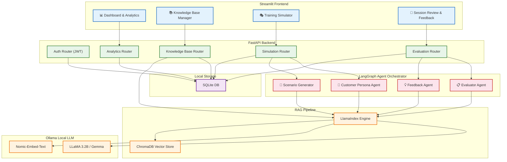
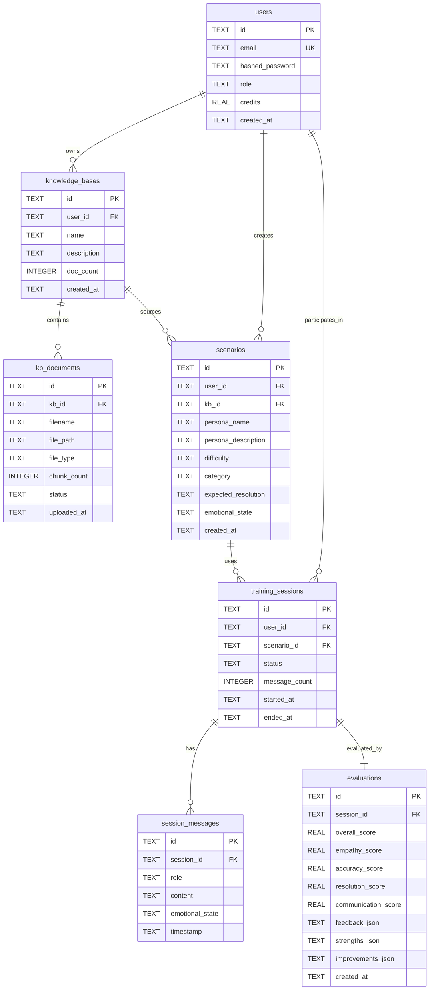

# SupportSim AI — Customer Support Agent Training Platform

A SaaS platform that uses agentic workflows and local LLMs to simulate customer interactions, train human support agents, and provide AI-powered feedback — all running locally at **$0 cost**.

## Architecture Overview



---

## User Review Required

> [!IMPORTANT]
> **Frontend Technology**: The spec says Streamlit. This is the best fit for a Python-only project with rapid prototyping. Streamlit communicates with the FastAPI backend via HTTP. Confirm this is the desired approach.

> [!IMPORTANT]
> **Folder Name Typo**: The existing folder is `customer-supprort` (double 'r'). Should we rename it to `customer-support`? I'll proceed with the existing name unless you say otherwise.

---

## Open Questions

> [!IMPORTANT]
> **LLM Model**: Your other projects use `llama3.2:3b`. Should we stick with that, or use a larger model like `gemma:4b` for more nuanced customer persona simulation? Smaller model = faster, larger = more realistic conversations.

> [!IMPORTANT]
> **Multi-tenancy / Auth**: Should this have full user auth (JWT login/register like legal-auditor) with per-organization knowledge bases, or start simpler as a single-user training tool? I'll plan for JWT auth by default to match your other projects.

> [!IMPORTANT]
> **SaaS / Stripe**: Should we include Stripe integration (credit-based billing for training sessions) like legal-auditor, or keep it free-to-use for now?

---

## Proposed Changes

### Phase 1: Foundation (Backend Core)

---

#### [NEW] [config.py](file:///Users/jyotiprakash/Desktop/live%20projects/AI%20stuffs/0_archi/customer-supprort/backend/config.py)
Central configuration — mirrors legal-auditor pattern:
- Ollama settings (model, URL, temperature, timeout)
- ChromaDB / SQLite paths
- JWT secret, API host/port, CORS
- Training-specific settings: `MAX_SIM_TURNS`, `DEFAULT_DIFFICULTY`, scenario categories

#### [NEW] [main.py](file:///Users/jyotiprakash/Desktop/live%20projects/AI%20stuffs/0_archi/customer-supprort/backend/main.py)
FastAPI entry point:
- CORS middleware
- Router registration (auth, knowledge_base, simulation, evaluation, analytics)
- Startup event: `db.init_db()` + RAG engine warm-up
- Health check endpoint

#### [NEW] [requirements.txt](file:///Users/jyotiprakash/Desktop/live%20projects/AI%20stuffs/0_archi/customer-supprort/backend/requirements.txt)
Python dependencies:
```
# Core
fastapi==0.115.0
uvicorn==0.30.0
python-multipart==0.0.9
pydantic==2.9.0
python-dotenv

# Auth
passlib[bcrypt]==1.7.4
bcrypt
python-jose[cryptography]==3.3.0

# RAG Pipeline
llama-index==0.11.0
llama-index-llms-ollama==0.3.0
llama-index-embeddings-ollama==0.3.0
llama-index-vector-stores-chroma==0.2.0
chromadb==0.5.0

# Agent Orchestration
langgraph
langchain
langchain-community
langchain-ollama

# Document Processing
pypdf>=4.0.1,<5.0.0
python-docx==1.1.0

# Frontend
streamlit>=1.38.0

# Testing
pytest==8.3.3
```

#### [NEW] [.env.example](file:///Users/jyotiprakash/Desktop/live%20projects/AI%20stuffs/0_archi/customer-supprort/backend/.env.example)
Template for environment variables.

#### [NEW] [.gitignore](file:///Users/jyotiprakash/Desktop/live%20projects/AI%20stuffs/0_archi/customer-supprort/.gitignore)
Standard Python + project ignores (venv, .env, __pycache__, chromadb_storage, *.db)

---

### Phase 2: Database & Services Layer

---

#### [NEW] [services/db.py](file:///Users/jyotiprakash/Desktop/live%20projects/AI%20stuffs/0_archi/customer-supprort/backend/services/db.py)
SQLite database service with these tables:

| Table | Purpose | Key Fields |
|-------|---------|------------|
| `users` | Auth & profiles | id, email, hashed_password, role (trainee/admin), credits |
| `knowledge_bases` | Company KB metadata | id, user_id, name, description, doc_count |
| `kb_documents` | Uploaded KB docs | id, kb_id, filename, file_path, chunk_count, status |
| `scenarios` | Training scenarios | id, user_id, kb_id, persona_name, persona_description, difficulty, category |
| `training_sessions` | Active/completed sessions | id, user_id, scenario_id, status, started_at, ended_at |
| `session_messages` | Chat messages per session | id, session_id, role (customer/agent/system), content, timestamp |
| `evaluations` | AI evaluation results | id, session_id, overall_score, empathy_score, accuracy_score, resolution_score, feedback_json |

Full CRUD operations for each table.

#### [NEW] [services/auth_utils.py](file:///Users/jyotiprakash/Desktop/live%20projects/AI%20stuffs/0_archi/customer-supprort/backend/services/auth_utils.py)
JWT authentication — identical pattern to legal-auditor:
- `create_access_token(user_id)` / `verify_token(token)`
- `get_current_user_id` FastAPI dependency
- bcrypt password hashing

#### [NEW] [services/rag_engine.py](file:///Users/jyotiprakash/Desktop/live%20projects/AI%20stuffs/0_archi/customer-supprort/backend/services/rag_engine.py)
RAG Engine (LlamaIndex + ChromaDB + Ollama):
- **Collection**: `support_knowledge_bases` (multi-tenant via `user_id` + `kb_id` metadata)
- `add_document(kb_id, user_id, text, filename)` → chunk, embed, store
- `query(question, user_id, kb_id, top_k)` → retrieve context from knowledge base
- `delete_document(doc_id)` → remove vectors
- This provides the "company knowledge" that powers realistic customer queries and accurate evaluation

#### [NEW] [services/doc_processor.py](file:///Users/jyotiprakash/Desktop/live%20projects/AI%20stuffs/0_archi/customer-supprort/backend/services/doc_processor.py)
Document processing for KB uploads (PDF, DOCX, TXT):
- Text extraction
- Chunking with overlap
- Page counting

---

### Phase 3: Agent Orchestration (LangGraph)

This is the **brain** of the platform — the domain-specific differentiator.

---

#### [NEW] [services/agents/customer_agent.py](file:///Users/jyotiprakash/Desktop/live%20projects/AI%20stuffs/0_archi/customer-supprort/backend/services/agents/customer_agent.py)
**Customer Persona Simulator** — LangGraph stateful agent:
- Takes a scenario (persona description, difficulty, issue category) as input
- Uses RAG to ground responses in company-specific knowledge (products, policies, FAQs)
- Maintains emotional state (frustrated → calm, or escalating based on agent quality)
- Generates realistic customer messages with appropriate tone/complexity
- LangGraph state graph:
  ```
  START → generate_message → wait_for_agent_response → assess_emotional_state → generate_message (loop)
       → if_resolved → END
  ```
- Difficulty levels affect vocabulary, patience, emotional volatility

#### [NEW] [services/agents/evaluator_agent.py](file:///Users/jyotiprakash/Desktop/live%20projects/AI%20stuffs/0_archi/customer-supprort/backend/services/agents/evaluator_agent.py)
**Response Evaluator** — analyzes trainee responses post-session:
- **Empathy Score** (0-100): Tone, acknowledgment, personalization
- **Accuracy Score** (0-100): Factual correctness vs. KB content (RAG-verified)
- **Resolution Score** (0-100): Problem addressed, next steps provided
- **Communication Score** (0-100): Clarity, professionalism, grammar
- **Overall Score**: Weighted average
- Uses RAG to compare agent answers against actual company knowledge
- Returns structured JSON evaluation

#### [NEW] [services/agents/feedback_agent.py](file:///Users/jyotiprakash/Desktop/live%20projects/AI%20stuffs/0_archi/customer-supprort/backend/services/agents/feedback_agent.py)
**Personalized Feedback Generator**:
- Takes evaluation scores + session transcript
- Generates specific, actionable feedback per dimension
- References best practices and company-specific guidelines (via RAG)
- Provides "what you did well" and "areas for improvement"
- Suggests alternative phrasings for weak responses

#### [NEW] [services/agents/scenario_generator.py](file:///Users/jyotiprakash/Desktop/live%20projects/AI%20stuffs/0_archi/customer-supprort/backend/services/agents/scenario_generator.py)
**Scenario Generator**:
- Auto-generates training scenarios from KB content
- Categories: billing, technical, complaint, feature request, onboarding, cancellation
- Difficulty: easy (straightforward issue), medium (multi-step), hard (emotional + complex)
- Outputs: persona_name, backstory, issue_description, expected_resolution, emotional_state

#### [NEW] [services/agents/orchestrator.py](file:///Users/jyotiprakash/Desktop/live%20projects/AI%20stuffs/0_archi/customer-supprort/backend/services/agents/orchestrator.py)
**Central LangGraph Orchestrator**:
- Coordinates multi-agent workflow:
  ```
  Scenario Generation → Customer Simulation ↔ Agent Response Loop → Evaluation → Feedback
  ```
- Manages LangGraph state (session context, message history, scores)
- Handles agent turn-taking and session termination conditions

---

### Phase 4: API Routers

---

#### [NEW] [routers/auth.py](file:///Users/jyotiprakash/Desktop/live%20projects/AI%20stuffs/0_archi/customer-supprort/backend/routers/auth.py)
Auth endpoints (same pattern as legal-auditor):
- `POST /api/auth/register` — create user
- `POST /api/auth/login` — issue JWT
- `GET /api/auth/me` — current user profile + stats

#### [NEW] [routers/knowledge_base.py](file:///Users/jyotiprakash/Desktop/live%20projects/AI%20stuffs/0_archi/customer-supprort/backend/routers/knowledge_base.py)
Knowledge Base management:
- `POST /api/kb` — create a new knowledge base
- `GET /api/kb` — list user's knowledge bases
- `POST /api/kb/{kb_id}/upload` — upload document to KB (extract → chunk → RAG index)
- `GET /api/kb/{kb_id}/documents` — list KB documents
- `DELETE /api/kb/{kb_id}/documents/{doc_id}` — remove document + vectors
- `DELETE /api/kb/{kb_id}` — delete entire KB

#### [NEW] [routers/simulation.py](file:///Users/jyotiprakash/Desktop/live%20projects/AI%20stuffs/0_archi/customer-supprort/backend/routers/simulation.py)
Training simulation management:
- `POST /api/simulation/scenarios/generate` — AI-generate scenarios from KB
- `GET /api/simulation/scenarios` — list available scenarios
- `POST /api/simulation/scenarios` — manually create a scenario
- `POST /api/simulation/start` — start a training session (scenario_id → customer agent begins)
- `POST /api/simulation/{session_id}/respond` — submit trainee response → get next customer message
- `POST /api/simulation/{session_id}/end` — end session (triggers evaluation)
- `GET /api/simulation/sessions` — list past training sessions

#### [NEW] [routers/evaluation.py](file:///Users/jyotiprakash/Desktop/live%20projects/AI%20stuffs/0_archi/customer-supprort/backend/routers/evaluation.py)
Evaluation & feedback:
- `POST /api/evaluation/{session_id}` — run AI evaluation on a completed session
- `GET /api/evaluation/{session_id}` — get evaluation results
- `GET /api/evaluation/{session_id}/feedback` — get personalized feedback

#### [NEW] [routers/analytics.py](file:///Users/jyotiprakash/Desktop/live%20projects/AI%20stuffs/0_archi/customer-supprort/backend/routers/analytics.py)
Dashboard analytics:
- `GET /api/analytics/dashboard` — summary stats (sessions, avg scores, trend data)
- `GET /api/analytics/progress` — trainee progress over time
- `GET /api/analytics/leaderboard` — comparative performance (multi-user)

---

### Phase 5: Streamlit Frontend

---

#### [NEW] [frontend/app.py](file:///Users/jyotiprakash/Desktop/live%20projects/AI%20stuffs/0_archi/customer-supprort/frontend/app.py)
Main Streamlit application with multi-page navigation:
- Login/Register page
- Session state management (JWT token, user info)
- API client utility for backend communication

#### [NEW] [frontend/pages/1_Dashboard.py](file:///Users/jyotiprakash/Desktop/live%20projects/AI%20stuffs/0_archi/customer-supprort/frontend/pages/1_Dashboard.py)
Training dashboard:
- KPI cards: Total Sessions, Average Score, Best Category, Sessions This Week
- Performance trend chart (line chart over time)
- Recent sessions table with scores
- Quick-start button to begin a new training

#### [NEW] [frontend/pages/2_Knowledge_Base.py](file:///Users/jyotiprakash/Desktop/live%20projects/AI%20stuffs/0_archi/customer-supprort/frontend/pages/2_Knowledge_Base.py)
Knowledge base management:
- Create new KB with name/description
- Upload documents (drag-and-drop via `st.file_uploader`)
- View KB documents with status indicators
- Delete documents/KBs

#### [NEW] [frontend/pages/3_Training.py](file:///Users/jyotiprakash/Desktop/live%20projects/AI%20stuffs/0_archi/customer-supprort/frontend/pages/3_Training.py)
The core training simulator:
- Scenario selection (from list or auto-generate)
- Real-time chat interface (`st.chat_message` / `st.chat_input`)
- Customer persona info panel (difficulty badge, category tag)
- Session controls (end session, request hint)
- Live emotional state indicator for the simulated customer

#### [NEW] [frontend/pages/4_Review.py](file:///Users/jyotiprakash/Desktop/live%20projects/AI%20stuffs/0_archi/customer-supprort/frontend/pages/4_Review.py)
Session review & feedback:
- Select a past session
- Full conversation transcript
- Score breakdown (radar/bar chart for each dimension)
- AI-generated feedback with specific recommendations
- Side-by-side comparison: your response vs. suggested ideal response

#### [NEW] [frontend/pages/5_Scenarios.py](file:///Users/jyotiprakash/Desktop/live%20projects/AI%20stuffs/0_archi/customer-supprort/frontend/pages/5_Scenarios.py)
Scenario management:
- View all scenarios (filter by difficulty, category)
- Create custom scenarios
- Auto-generate scenarios from KB content
- Edit/delete scenarios

#### [NEW] [frontend/utils/api_client.py](file:///Users/jyotiprakash/Desktop/live%20projects/AI%20stuffs/0_archi/customer-supprort/frontend/utils/api_client.py)
Reusable API client:
- `requests`-based HTTP client with JWT header injection
- Error handling and status code mapping
- All API endpoint methods

#### [NEW] [frontend/utils/styles.py](file:///Users/jyotiprakash/Desktop/live%20projects/AI%20stuffs/0_archi/customer-supprort/frontend/utils/styles.py)
Custom CSS injection for Streamlit:
- Dark theme with emerald/teal accents
- Custom metric cards
- Chat bubble styling
- Score visualization theming

---

## File Structure

```
customer-supprort/
├── backend/
│   ├── .env                        # Secrets (git-ignored)
│   ├── .env.example                # Template
│   ├── config.py                   # Central configuration
│   ├── main.py                     # FastAPI entry point
│   ├── requirements.txt            # Python dependencies
│   ├── routers/
│   │   ├── __init__.py
│   │   ├── auth.py                 # Login, Register, JWT
│   │   ├── knowledge_base.py       # KB CRUD + doc upload
│   │   ├── simulation.py           # Session management + chat
│   │   ├── evaluation.py           # Scoring + feedback
│   │   └── analytics.py            # Dashboard data
│   └── services/
│       ├── __init__.py
│       ├── auth_utils.py           # JWT helpers
│       ├── db.py                   # SQLite operations
│       ├── doc_processor.py        # PDF/DOCX extraction
│       ├── rag_engine.py           # LlamaIndex + ChromaDB + Ollama
│       └── agents/
│           ├── __init__.py
│           ├── orchestrator.py     # LangGraph workflow coordinator
│           ├── customer_agent.py   # Simulated customer persona
│           ├── evaluator_agent.py  # Response evaluation
│           ├── feedback_agent.py   # Personalized feedback
│           └── scenario_generator.py # Auto-scenario creation
├── frontend/
│   ├── app.py                      # Streamlit main entry
│   ├── pages/
│   │   ├── 1_Dashboard.py
│   │   ├── 2_Knowledge_Base.py
│   │   ├── 3_Training.py
│   │   ├── 4_Review.py
│   │   └── 5_Scenarios.py
│   └── utils/
│       ├── api_client.py           # Backend HTTP client
│       └── styles.py               # Custom CSS theming
├── .gitignore
└── README.md
```

---

## Database ERD



---

## Verification Plan

### Automated Tests
1. **Backend unit tests** — test each DB CRUD function, auth utils, doc processor
2. **API integration tests** — test each router endpoint with `TestClient`
3. **Agent tests** — verify customer agent generates valid responses, evaluator returns structured scores
4. **RAG tests** — verify document indexing and retrieval with metadata filtering

### Manual Verification
1. **Start Ollama** → `ollama serve` + `ollama pull llama3.2:3b` + `ollama pull nomic-embed-text`
2. **Start Backend** → `cd backend && python main.py` → verify `/api/health` returns OK
3. **Start Frontend** → `cd frontend && streamlit run app.py`
4. **End-to-end flow**:
   - Register/login
   - Create a KB → upload a sample company FAQ document
   - Auto-generate scenarios from the KB
   - Start a training session → chat with AI customer
   - End session → view evaluation scores + feedback
   - Check dashboard analytics

---

## Execution Order

| Phase | Focus | Est. Files |
|-------|-------|------------|
| **1** | Foundation: config, main.py, requirements, .env, .gitignore | 5 |
| **2** | Services: db.py, auth_utils.py, rag_engine.py, doc_processor.py | 4 |
| **3** | Agents: customer_agent, evaluator, feedback, scenario_gen, orchestrator | 5 |
| **4** | Routers: auth, knowledge_base, simulation, evaluation, analytics | 5 |
| **5** | Frontend: app.py, 5 pages, api_client, styles | 8 |

**Total: ~27 new files** — fully functional, production-grade training platform.
