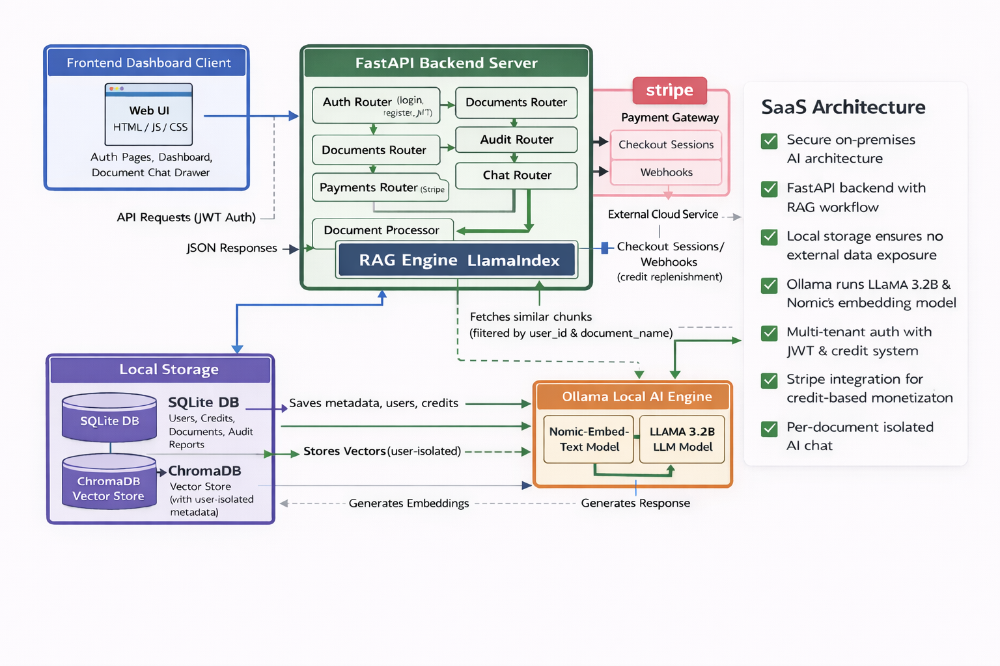
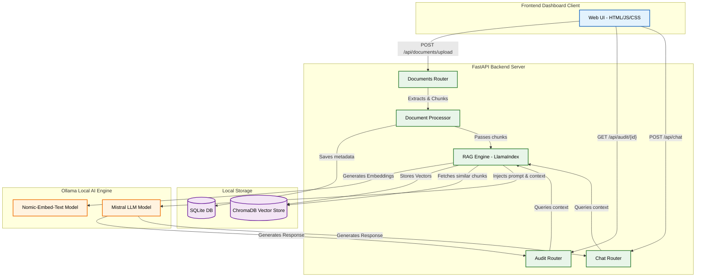
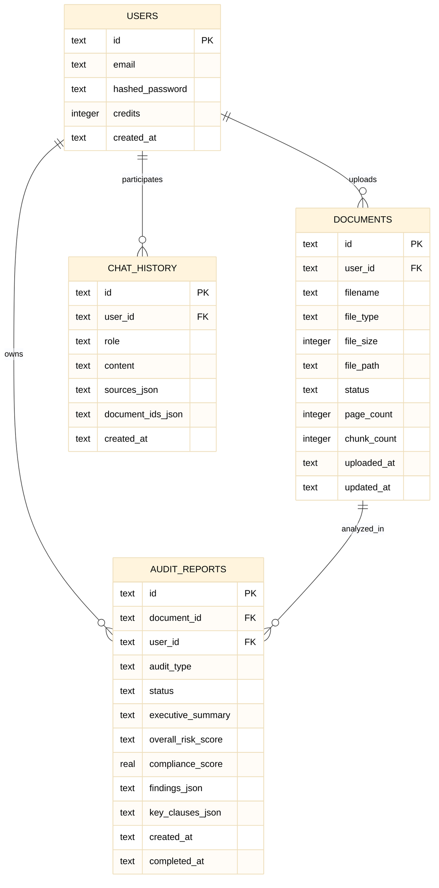

# 🛡️ LegalShield AI

**Privacy-First, AI-Powered Legal Document Auditor — SaaS Platform**

A production-grade SaaS application that audits legal documents using AI — with **100% local inference**. Your documents never leave your machine. Powered by Ollama, LlamaIndex, ChromaDB, and Stripe.

---

## ✨ Key Features

- **🔒 Zero Data Leakage** — All AI models, embeddings, and databases run 100% locally
- **📄 Intelligent Auditing** — Upload contracts/policies and get comprehensive risk analysis with compliance scores
- **💬 Document Chat** — Ask questions about any specific document via a slide-out chat drawer
- **👥 Multi-Tenant** — JWT authentication with user-isolated data (each user sees only their own documents)
- **💳 Credit System** — Stripe-powered monetization (1 credit = 1 audit, 0.1 credit = 1 chat query)
- **🎨 Premium UI** — Dark-mode glassmorphism design with micro-animations

---

## 🏗️ Tech Stack

| Layer | Technology |
|-------|-----------|
| Frontend | HTML, CSS, JavaScript (Vanilla SPA) |
| Backend | Python 3, FastAPI, Uvicorn |
| AI / LLM | Ollama, LLaMA 3.2B |
| Embeddings | Nomic-Embed-Text |
| RAG Framework | LlamaIndex |
| Vector DB | ChromaDB (persistent, local) |
| Database | SQLite |
| Auth | JWT + bcrypt |
| Payments | Stripe |

---

## 🏗️ System Architecture





---

## 📊 Database ERD



---

## 📋 Prerequisites

Before you begin, make sure you have the following installed:

- **Python 3.10+** — [python.org](https://www.python.org/downloads/)
- **Node.js 18+** — [nodejs.org](https://nodejs.org/)
- **Ollama** — [ollama.com](https://ollama.com/)
- **Stripe Account (Test Mode)** — [stripe.com](https://dashboard.stripe.com/test/apikeys)

---

## 🚀 Setup Guide

### Step 1: Clone the Repository

```bash
git clone <your-repo-url>
cd legal-auditor
```

### Step 2: Install & Pull AI Models (Ollama)

```bash
# Start Ollama (if not running)
ollama serve

# Pull required models (one-time download)
ollama pull llama3.2:3b
ollama pull nomic-embed-text
```

> **Note:** `llama3.2:3b` is ~2GB and `nomic-embed-text` is ~270MB. These download once and run locally forever.

### Step 3: Setup Backend

```bash
cd backend

# Create virtual environment
python3 -m venv venv
source venv/bin/activate      # macOS/Linux
# venv\Scripts\activate       # Windows

# Install dependencies
pip install -r requirements.txt

# Configure environment variables
cp .env.example .env
```

Now edit `backend/.env` with your actual keys:

```env
# Required — Get from https://dashboard.stripe.com/test/apikeys
STRIPE_API_KEY=sk_test_YOUR_KEY
STRIPE_WEBHOOK_SECRET=whsec_YOUR_SECRET
STRIPE_PUBLISHABLE_KEY=pk_test_YOUR_KEY

# Recommended — Change to a random string
JWT_SECRET_KEY=your-random-secret-key-here
```

### Step 4: Setup Frontend

```bash
cd ../frontend

# Install dependencies
npm install
```

### Step 5: Run the Application

Open **three terminal windows**:

**Terminal 1 — Ollama (AI Engine):**
```bash
ollama serve
```

**Terminal 2 — Backend (API Server):**
```bash
cd backend
source venv/bin/activate
uvicorn main:app --reload
```
> Backend runs at: `http://localhost:8000`

**Terminal 3 — Frontend (Web Server):**
```bash
cd frontend
npm start
```
> Frontend runs at: `http://localhost:3000`

### Step 6: Open the App

Navigate to **http://localhost:3000** in your browser.

1. **Register** a new account
2. **Upload** a legal document (PDF, DOCX, or TXT)
3. **Audit** — Click "Audit" to run AI analysis
4. **Chat** — Click "Chat" to ask questions about the document
5. **Buy Credits** — Click "Buy Credits" when you need more

---

## 💳 Stripe Setup (for Payments)

### Test Mode (Development)

1. Go to [Stripe Dashboard → API Keys](https://dashboard.stripe.com/test/apikeys)
2. Copy your **Publishable key** (`pk_test_...`) and **Secret key** (`sk_test_...`)
3. Paste them into `backend/.env`

### Webhook (Local Development)

For local webhook testing, use the Stripe CLI:

```bash
# Install Stripe CLI
brew install stripe/stripe-cli/stripe

# Login to your Stripe account
stripe login

# Forward webhooks to your local server
stripe listen --forward-to localhost:8000/api/payments/webhook
```

Copy the `whsec_...` signing secret from the CLI output and paste it into `backend/.env` as `STRIPE_WEBHOOK_SECRET`.

---

## 📁 Project Structure

```
legal-auditor/
├── backend/
│   ├── .env                    # Secret keys (git-ignored)
│   ├── .env.example            # Template for new developers
│   ├── config.py               # Loads .env, defines all settings
│   ├── main.py                 # FastAPI app entry point
│   ├── requirements.txt        # Python dependencies
│   ├── routers/
│   │   ├── auth.py             # Login, Register, JWT, /me
│   │   ├── audit.py            # AI audit execution & reports
│   │   ├── chat.py             # RAG-powered document Q&A
│   │   ├── documents.py        # Upload, list, delete documents
│   │   └── payments.py         # Stripe checkout & webhooks
│   └── services/
│       ├── auth_utils.py       # JWT helpers & dependencies
│       ├── db.py               # SQLite operations
│       ├── doc_processor.py    # PDF/DOCX text extraction
│       └── rag_engine.py       # LlamaIndex + ChromaDB + Ollama
├── frontend/
│   ├── index.html              # SPA shell with sidebar & drawer
│   ├── style.css               # Premium dark-mode design system
│   ├── app.js                  # Router, state, API client
│   ├── server.js               # Express.js static file server
│   └── components/
│       ├── auth.js             # Login/Register/Logout UI
│       ├── dashboard.js        # Dashboard stats & recent docs
│       ├── upload.js           # File upload with drag-and-drop
│       ├── documents.js        # Document management table
│       ├── audit-report.js     # Audit report visualization
│       ├── chat.js             # Global + Drawer chat logic
│       ├── pricing.js          # Credit purchase page
│       └── sidebar.js          # Sidebar navigation
├── architecture_design.md      # Detailed architecture documentation
├── .gitignore                  # Protects secrets & generated data
└── README.md                   # This file
```

---

## 🔐 Environment Variables

| Variable | Required | Description |
|----------|----------|-------------|
| `OLLAMA_BASE_URL` | No | Ollama server URL (default: `http://localhost:11434`) |
| `LLM_MODEL` | No | LLM model name (default: `llama3.2:3b`) |
| `EMBED_MODEL` | No | Embedding model (default: `nomic-embed-text`) |
| `JWT_SECRET_KEY` | **Yes** | Random secret for JWT token signing |
| `STRIPE_API_KEY` | **Yes** | Stripe secret key (`sk_test_...`) |
| `STRIPE_WEBHOOK_SECRET` | **Yes** | Stripe webhook signing secret (`whsec_...`) |
| `STRIPE_PUBLISHABLE_KEY` | **Yes** | Stripe publishable key (`pk_test_...`) |

---

## 💰 Credit System

| Operation | Cost | Description |
|-----------|------|-------------|
| Document Audit | 1.0 credit | Full AI risk analysis with PDF report |
| Chat Query | 0.1 credit | RAG-powered Q&A about a specific document |
| New Account | 5.0 credits | Starter credits on registration |

---

## 🛠️ Troubleshooting

### "Ollama is not running"
```bash
# Check if Ollama is running
curl http://localhost:11434/api/version

# Start Ollama
ollama serve
```

### "Model not found"
```bash
# Pull the required models
ollama pull llama3.2:3b
ollama pull nomic-embed-text
```

### Frontend not loading latest changes
Press `Cmd+Shift+R` (Mac) or `Ctrl+Shift+R` (Windows) to hard refresh. The app uses cache-busted script tags (`?v=2`).

### Empty chat responses
If documents were uploaded before the multi-tenant update, they lack `user_id` metadata. **Delete and re-upload** them to fix.

### Stripe webhook not working locally
Make sure you're using the Stripe CLI (`stripe listen --forward-to ...`). Dashboard webhooks cannot reach `localhost`.

---

## 📄 License

This project is built for educational and demonstration purposes.

---

**Built with ❤️ using the $0 AI Architecture Stack — Privacy First, Always.**
