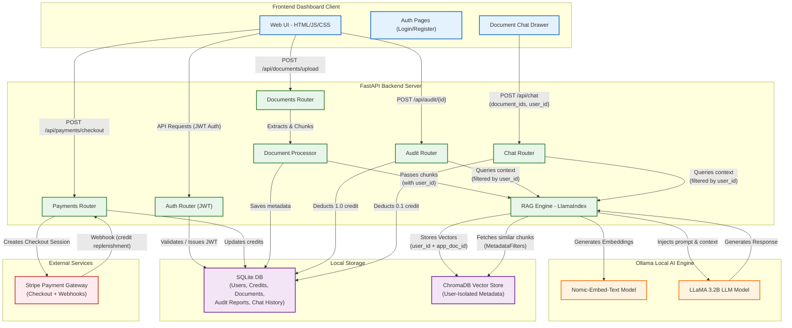

# LegalShield AI — SaaS Architecture Design

This document outlines the architecture, components, and data flow for the **LegalShield AI** platform — a privacy-first, multi-tenant SaaS legal document auditor. The system emphasizes **100% local AI inference**, with Stripe as the only external service for payment processing.

## Architecture Diagram



---

## Component Breakdown

### 1. Frontend Dashboard (Client)
- **Technology:** Vanilla HTML, CSS, JavaScript (Single Page Application).
- **Design:** Premium dark-mode glassmorphism with amber/gold accents, micro-animations, and smooth transitions.
- **Key UI Components:**
  - **Auth Pages** — Login & Register forms with JWT token management
  - **Dashboard** — KPI cards (documents, audits, credits), recent documents table
  - **Upload** — Drag-and-drop document upload with progress indicators
  - **Documents** — Full document management table with Audit, Chat, and Delete actions
  - **Audit Report** — Compliance ring chart, risk KPI cards, findings grid, key clauses sidebar
  - **Document Chat Drawer** — Slide-out panel from the right side for per-document AI Q&A
  - **Pricing Page** — Stripe-powered credit purchase with checkout redirect
- **Sidebar** — Hidden when logged out; shows navigation, user avatar, credit balance, Buy Credits, and Logout when authenticated.

### 2. FastAPI Backend Server
- **Technology:** Python, FastAPI, Uvicorn (ASGI server).
- **Configuration:** Environment variables loaded from `.env` via `python-dotenv`.
- **Responsibility:** Central orchestrator routing requests, processing files, managing authentication, and connecting services.
- **Routers:**
  - **Auth Router** (`/api/auth`) — User registration, login, JWT token issuance, and `/me` endpoint for profile/credit retrieval.
  - **Documents Router** (`/api/documents`) — File upload, text extraction, RAG indexing with user-isolated metadata, listing, and deletion.
  - **Audit Router** (`/api/audit`) — AI-powered legal analysis, audit report generation and storage, PDF download. Deducts **1.0 credit** per audit.
  - **Chat Router** (`/api/chat`) — RAG-powered document Q&A with multi-tenant metadata filtering. Deducts **0.1 credit** per query. Validates credit balance before processing.
  - **Payments Router** (`/api/payments`) — Stripe checkout session creation and webhook handling for automatic credit replenishment.
- **Core Services:**
  - **Document Processor** — Parses PDFs, DOCX, and TXT files; extracts raw text; breaks into chunks.
  - **RAG Engine (LlamaIndex)** — Coordinates embedding, vector storage with `user_id` + `app_doc_id` metadata, and retrieval-augmented generation with `MetadataFilters` for strict tenant isolation.
  - **Auth Utils** — JWT token creation, validation, and dependency injection for protected routes.

### 3. Local Databases
- **SQLite Database:** Stores relational data:
  - `users` — id, email, hashed password, credits (float), created_at
  - `documents` — id, user_id, filename, file_path, status, page_count, chunk_count
  - `audit_reports` — id, user_id, document_id, findings, risk scores, compliance data
  - `chat_messages` — id, user_id, role, content, sources, document_ids
- **ChromaDB Vector Store:** Persistent local vector database with user-isolated metadata. Each chunk is tagged with:
  - `user_id` — For multi-tenant data isolation
  - `app_doc_id` — For document-specific filtering (uses `app_doc_id` to avoid LlamaIndex's internal `doc_id` key collision)
  - `filename` — For source citation in responses

### 4. Local AI Engine (Ollama)
- **Technology:** Ollama (running entirely locally, zero external API calls).
- **Models Used:**
  - **`nomic-embed-text` (Embedding Model):** Converts document chunks and user queries into numerical vectors for semantic similarity search.
  - **`llama3.2:3b` (Large Language Model):** Handles legal document analysis, audit report generation, risk assessment, and conversational Q&A. All inference runs on-device.

### 5. External Services
- **Stripe Payment Gateway:** The **only** external service in the entire architecture.
  - **Checkout Sessions** — Creates payment pages for credit purchases
  - **Webhooks** — Receives `checkout.session.completed` events to automatically replenish user credits
  - **Security** — Webhook signature verification via `Stripe-Signature` header

---

## Security & Multi-Tenancy

| Feature | Implementation |
|---------|----------------|
| Authentication | JWT tokens with bcrypt password hashing |
| Route Protection | `Depends(get_current_user_id)` on all API endpoints |
| Data Isolation | ChromaDB `MetadataFilters` with `ExactMatchFilter(key="user_id")` |
| Document Ownership | SQLite foreign key `user_id` on all document/audit/chat tables |
| Secret Management | `.env` file (git-ignored) with `python-dotenv` loader |
| Credit Validation | Pre-flight balance check before AI operations |

---

## Credit System

| Operation | Credit Cost | Description |
|-----------|-------------|-------------|
| Document Audit | 1.0 | Full AI risk analysis with report generation |
| Chat Query | 0.1 | Single RAG-powered question about a document |
| Credit Purchase | Via Stripe | Automated webhook replenishment |

Credits are stored as `REAL` (float) values in SQLite, enabling fractional billing.

---

## Data Flow Examples

### Scenario A: User Registration & Login
1. **Frontend:** User submits email/password on the Register page.
2. **Backend:** Auth Router hashes the password, creates a user with starter credits in SQLite, and returns a JWT token.
3. **Frontend:** Stores the JWT in `localStorage`, unhides the sidebar, and redirects to the Dashboard.

### Scenario B: Uploading a Document
1. **Frontend:** User drags a PDF into the upload zone. The UI sends a `multipart/form-data` request with the JWT `Authorization` header.
2. **Backend:** Documents Router extracts text, chunks it into ~1024-character segments.
3. **RAG Indexing:** Each chunk is tagged with `user_id` and `app_doc_id` metadata, embedded via `nomic-embed-text`, and stored in ChromaDB.
4. **Storage:** Document metadata (filename, status, chunk count) is saved to SQLite.

### Scenario C: Running an AI Audit
1. **Frontend:** User clicks "Audit" on a document row. Progress animation begins.
2. **Backend:** Audit Router checks credit balance (≥ 1.0), extracts document text, and sends it to LLaMA 3.2B with a structured legal analysis prompt.
3. **AI Processing:** LLaMA generates findings, risk levels, compliance scores, and recommendations.
4. **Storage:** Report is stored in SQLite. **1.0 credit** is deducted. Updated credits are sent to the frontend.

### Scenario D: Document-Specific Chat (Drawer)
1. **Frontend:** User clicks "Chat" on a document row. A slide-out drawer opens from the right.
2. **Backend:** Chat Router validates credits (≥ 0.1), then queries the RAG Engine with `user_id` and `document_ids` filters.
3. **RAG Pipeline:** ChromaDB retrieves only chunks matching both the user and the specific document. LLaMA generates a contextual answer with source citations.
4. **Billing:** **0.1 credit** is deducted. Sidebar credit display updates in real-time.

### Scenario E: Buying Credits
1. **Frontend:** User clicks "Buy Credits" → Pricing page → Selects a plan.
2. **Backend:** Payments Router creates a Stripe Checkout Session with `client_reference_id` (user ID) and `metadata.credits`.
3. **Stripe:** User completes payment on Stripe's hosted page. Stripe fires a `checkout.session.completed` webhook.
4. **Backend:** Webhook endpoint verifies the signature, extracts the credit amount, and adds it to the user's balance in SQLite.
5. **Frontend:** Detects `?payment=success` in the URL, fetches updated credits from `/api/auth/me`, and refreshes the sidebar.

---

## Tech Stack Summary

| Layer | Technology |
|-------|-----------|
| Frontend | HTML, CSS, JavaScript (Vanilla SPA) |
| Backend | Python 3, FastAPI, Uvicorn |
| AI / LLM | Ollama, LLaMA 3.2B |
| Embeddings | Nomic-Embed-Text |
| RAG Framework | LlamaIndex |
| Vector Database | ChromaDB (persistent, local) |
| Relational Database | SQLite |
| Authentication | JWT (JSON Web Tokens), bcrypt |
| Payments | Stripe (Checkout Sessions + Webhooks) |
| Config Management | python-dotenv (.env) |

---

## File Structure

```
legal-auditor/
├── backend/
│   ├── .env                    # Secret keys (git-ignored)
│   ├── .env.example            # Template for new developers
│   ├── config.py               # Loads .env, defines all settings
│   ├── main.py                 # FastAPI app entry point
│   ├── requirements.txt        # Python dependencies
│   ├── routers/
│   │   ├── auth.py             # Login, Register, JWT, /me
│   │   ├── audit.py            # AI audit execution & reports
│   │   ├── chat.py             # RAG-powered document Q&A
│   │   ├── documents.py        # Upload, list, delete documents
│   │   └── payments.py         # Stripe checkout & webhooks
│   └── services/
│       ├── auth_utils.py       # JWT helpers & dependencies
│       ├── db.py               # SQLite operations
│       ├── doc_processor.py    # PDF/DOCX text extraction
│       └── rag_engine.py       # LlamaIndex + ChromaDB + Ollama
├── frontend/
│   ├── index.html              # SPA shell with sidebar & drawer
│   ├── style.css               # Premium dark-mode design system
│   ├── app.js                  # Router, state, API client, drawer logic
│   ├── server.js               # Express.js static file server
│   └── components/
│       ├── auth.js             # Login/Register/Logout UI
│       ├── dashboard.js        # Dashboard stats & recent docs
│       ├── upload.js           # File upload with drag-and-drop
│       ├── documents.js        # Document management table
│       ├── audit-report.js     # Audit report visualization
│       ├── chat.js             # Global chat + drawer chat logic
│       ├── pricing.js          # Credit purchase page
│       └── sidebar.js          # Sidebar navigation
└── .gitignore                  # Protects secrets & generated data
```
