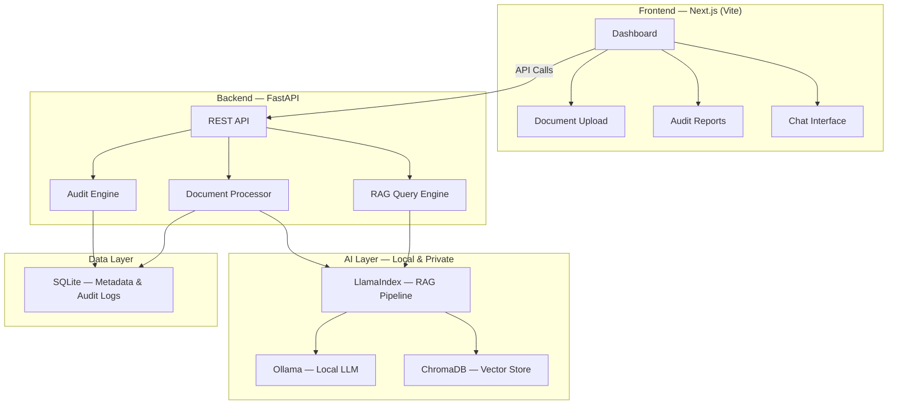

# Privacy-First Legal Document Auditor — Implementation Plan

A SaaS platform for law firms and legal departments to **securely analyze and audit sensitive legal documents** (contracts, agreements, case files) for compliance, discrepancies, and key information extraction — with **zero data leaving the local environment**.

---

## High-Level Architecture



---

## User Review Required

> [!IMPORTANT]
> **Local LLM Requirement:** This application requires [Ollama](https://ollama.com) to be installed on the machine. The plan uses `mistral` (7B) as the default model for fast inference. If you have a powerful GPU, we can switch to `llama3.3` or `gemma4` for better quality. **Do you have Ollama installed? Which model do you prefer?**

> [!IMPORTANT]
> **Scope Decision:** This plan builds a **fully functional MVP** with:
> - Document upload (PDF/DOCX/TXT)
> - AI-powered document analysis (clause extraction, risk flagging, compliance checks)
> - RAG-powered Q&A chat over your documents
> - Audit trail & report generation
> - Premium, modern dark-mode UI
>
> Is this scope good, or do you want to add/remove features?

> [!WARNING]
> **Hardware:** Running local LLMs requires decent hardware. The `mistral` 7B model needs ~8GB RAM. Larger models (70B) need 32–64GB RAM + GPU. The plan defaults to lightweight models that run on most machines.

---

## Tech Stack (Aligned with $0 Architecture)

| Layer | Technology | Cost |
|---|---|---|
| **Frontend** | Next.js (Vite) + Vanilla CSS | $0 |
| **Backend API** | FastAPI + Uvicorn | $0 |
| **RAG Framework** | LlamaIndex | $0 |
| **Vector DB** | ChromaDB (local persistent) | $0 |
| **LLM Inference** | Ollama (mistral / llama3.3) | $0 |
| **Embeddings** | nomic-embed-text (via Ollama) | $0 |
| **Database** | SQLite | $0 |
| **PDF Processing** | pypdf, python-docx | $0 |
| **Total** | | **$0** |

---

## Project Structure

```
0$-archi/legal-auditor/
├── backend/
│   ├── main.py                    # FastAPI entry point
│   ├── config.py                  # Configuration & settings
│   ├── requirements.txt           # Python dependencies
│   ├── routers/
│   │   ├── __init__.py
│   │   ├── documents.py           # Document upload/management endpoints
│   │   ├── audit.py               # Audit analysis endpoints
│   │   └── chat.py                # RAG chat endpoints
│   ├── services/
│   │   ├── __init__.py
│   │   ├── document_processor.py  # PDF/DOCX parsing & chunking
│   │   ├── rag_engine.py          # LlamaIndex + ChromaDB RAG pipeline
│   │   ├── audit_engine.py        # AI-powered audit logic
│   │   └── db.py                  # SQLite database service
│   ├── models/
│   │   ├── __init__.py
│   │   └── schemas.py             # Pydantic models
│   ├── data/                      # Uploaded documents storage
│   └── chromadb_storage/          # Persistent vector store
│
├── frontend/
│   ├── index.html                 # Main HTML entry
│   ├── style.css                  # Premium design system
│   ├── app.js                     # Main application logic
│   ├── components/
│   │   ├── sidebar.js             # Navigation sidebar
│   │   ├── dashboard.js           # Dashboard with KPIs
│   │   ├── upload.js              # Document upload with drag & drop
│   │   ├── documents.js           # Document library/list
│   │   ├── audit-report.js        # Audit report view
│   │   ├── chat.js                # RAG chat interface
│   │   └── settings.js            # Settings panel
│   └── assets/
│       └── icons/                 # SVG icons
│
└── README.md
```

> [!NOTE]
> We're building the frontend as a **single-page application** using vanilla HTML/CSS/JS (no framework bundler needed) to keep it simple and aligned with the $0 philosophy. The design will be **premium-grade** with glassmorphism, smooth animations, and a dark legal-themed color palette.

---

## Proposed Changes

### Component 1: Backend — FastAPI + RAG Pipeline

#### [NEW] [main.py](file:///Users/jyotiprakash/Desktop/live%20projects/AI%20stuffs/0$-archi/legal-auditor/backend/main.py)
- FastAPI application with CORS middleware
- Mount routers for `/api/documents`, `/api/audit`, `/api/chat`
- Startup event to initialize RAG engine and database

#### [NEW] [config.py](file:///Users/jyotiprakash/Desktop/live%20projects/AI%20stuffs/0$-archi/legal-auditor/backend/config.py)
- Centralized configuration: Ollama model name, ChromaDB path, SQLite path, upload directory
- Environment variable support via `.env`

#### [NEW] [requirements.txt](file:///Users/jyotiprakash/Desktop/live%20projects/AI%20stuffs/0$-archi/legal-auditor/backend/requirements.txt)
- `fastapi`, `uvicorn`, `llama-index`, `llama-index-llms-ollama`, `llama-index-embeddings-ollama`, `llama-index-vector-stores-chroma`, `chromadb`, `pypdf`, `python-docx`, `python-multipart`, `aiosqlite`

---

#### [NEW] [documents.py](file:///Users/jyotiprakash/Desktop/live%20projects/AI%20stuffs/0$-archi/legal-auditor/backend/routers/documents.py)
- `POST /api/documents/upload` — Upload PDF/DOCX/TXT, parse text, chunk, embed into ChromaDB
- `GET /api/documents` — List all uploaded documents with metadata
- `GET /api/documents/{id}` — Get document details
- `DELETE /api/documents/{id}` — Remove document and its vectors

#### [NEW] [audit.py](file:///Users/jyotiprakash/Desktop/live%20projects/AI%20stuffs/0$-archi/legal-auditor/backend/routers/audit.py)
- `POST /api/audit/{document_id}` — Run comprehensive AI audit on a document
- `GET /api/audit/{document_id}/report` — Get the audit report
- Audit checks include: clause extraction, risk identification, compliance gaps, missing clauses, ambiguous language detection

#### [NEW] [chat.py](file:///Users/jyotiprakash/Desktop/live%20projects/AI%20stuffs/0$-archi/legal-auditor/backend/routers/chat.py)
- `POST /api/chat` — Send a query about uploaded documents, get RAG-powered response with source citations

---

#### [NEW] [document_processor.py](file:///Users/jyotiprakash/Desktop/live%20projects/AI%20stuffs/0$-archi/legal-auditor/backend/services/document_processor.py)
- Extract text from PDF (pypdf), DOCX (python-docx), TXT files
- Clean and normalize extracted text
- Split into semantic chunks for embedding

#### [NEW] [rag_engine.py](file:///Users/jyotiprakash/Desktop/live%20projects/AI%20stuffs/0$-archi/legal-auditor/backend/services/rag_engine.py)
- Initialize Ollama LLM and embedding model
- Configure ChromaDB as persistent vector store
- Build and manage LlamaIndex `VectorStoreIndex`
- Provide `query()` method for RAG-based Q&A with source attribution

#### [NEW] [audit_engine.py](file:///Users/jyotiprakash/Desktop/live%20projects/AI%20stuffs/0$-archi/legal-auditor/backend/services/audit_engine.py)
- Uses local LLM to perform structured analysis:
  - **Risk Assessment** — Flag high/medium/low risk clauses
  - **Compliance Check** — Check against common legal standards
  - **Key Clause Extraction** — Identify important clauses (termination, liability, indemnification, etc.)
  - **Discrepancy Detection** — Find contradictions or vague terms
  - **Summary Generation** — Executive summary with findings

#### [NEW] [db.py](file:///Users/jyotiprakash/Desktop/live%20projects/AI%20stuffs/0$-archi/legal-auditor/backend/services/db.py)
- SQLite schema: `documents` table, `audit_reports` table, `chat_history` table
- Full CRUD operations
- Audit trail logging

#### [NEW] [schemas.py](file:///Users/jyotiprakash/Desktop/live%20projects/AI%20stuffs/0$-archi/legal-auditor/backend/models/schemas.py)
- Pydantic models for request/response validation

---

### Component 2: Frontend — Premium Legal Dashboard

#### [NEW] [index.html](file:///Users/jyotiprakash/Desktop/live%20projects/AI%20stuffs/0$-archi/legal-auditor/frontend/index.html)
- Single-page application shell
- Google Fonts (Inter)
- Responsive meta tags

#### [NEW] [style.css](file:///Users/jyotiprakash/Desktop/live%20projects/AI%20stuffs/0$-archi/legal-auditor/frontend/style.css)
Premium design system featuring:
- **Color Palette:** Deep navy/slate dark mode with amber/gold accents (legal-professional aesthetic)
- **Glassmorphism:** Frosted glass cards with subtle borders
- **Typography:** Inter font family, clean hierarchy
- **Animations:** Smooth page transitions, hover effects, loading states
- **Components:** Buttons, cards, badges, tables, modals, progress bars, chat bubbles

#### [NEW] [app.js](file:///Users/jyotiprakash/Desktop/live%20projects/AI%20stuffs/0$-archi/legal-auditor/frontend/app.js)
- Client-side SPA router (hash-based)
- API client for backend communication
- State management
- Component rendering orchestration

#### [NEW] Frontend Components
| Component | Purpose |
|---|---|
| `sidebar.js` | Fixed navigation with icons, active states, branding |
| `dashboard.js` | KPI cards (documents analyzed, risks found, compliance score), recent activity feed |
| `upload.js` | Drag-and-drop upload zone with progress animation, file type validation |
| `documents.js` | Sortable/filterable document library with status badges |
| `audit-report.js` | Detailed audit view: risk heatmap, clause cards, compliance checklist, executive summary |
| `chat.js` | Chat interface with message bubbles, typing indicator, source citations |
| `settings.js` | Model selection, theme toggle |

---

## UI Design Concept

The dashboard will feature:
- **Dark navy background** (`#0a0e1a`) with subtle grid pattern
- **Glassmorphic cards** with `backdrop-filter: blur()` and semi-transparent borders
- **Gold/amber accents** (`#f0b429`) for important actions and highlights
- **Risk severity colors:** Red for high risk, amber for medium, green for low
- **Smooth micro-animations** on all interactive elements
- **Professional typography** — clean, scannable, action-oriented

---

## Open Questions

> [!IMPORTANT]
> 1. **Do you have Ollama installed?** If not, I'll include setup instructions. What model do you want to use? (default: `mistral`)
> 2. **Document types:** Should we support only PDF for MVP, or also DOCX and TXT from the start?
> 3. **Any specific legal compliance frameworks** you want the auditor to check against? (e.g., GDPR, SOC 2, specific contract law standards)

---

## Verification Plan

### Automated Tests
1. Start the FastAPI backend and verify all API endpoints return correct responses
2. Upload a sample PDF and verify it gets processed and indexed in ChromaDB
3. Run an audit on the uploaded document and verify the report is generated
4. Send a chat query and verify RAG-powered response with citations
5. Open the frontend in a browser and verify all pages render correctly

### Manual Verification
- Visual inspection of the UI for premium aesthetics
- End-to-end flow: Upload → Audit → Review Report → Chat Q&A
- Verify that no data leaves the local machine (network tab inspection)
